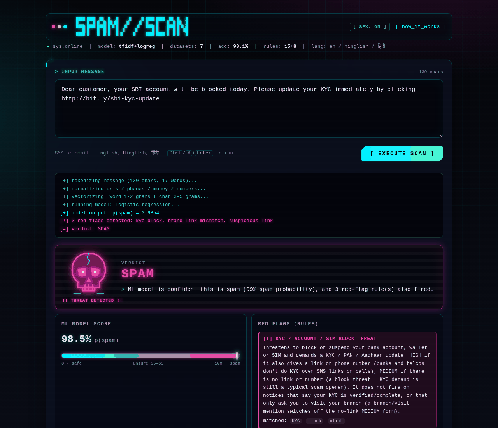
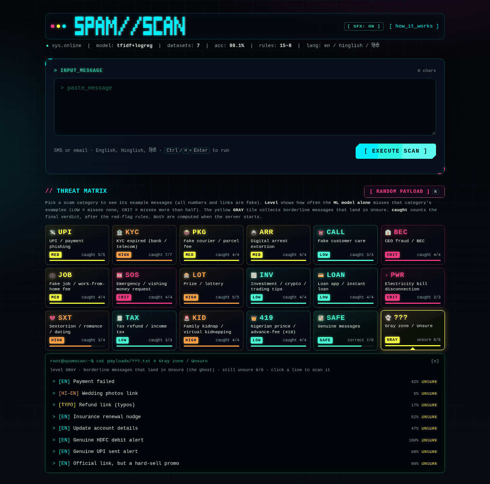
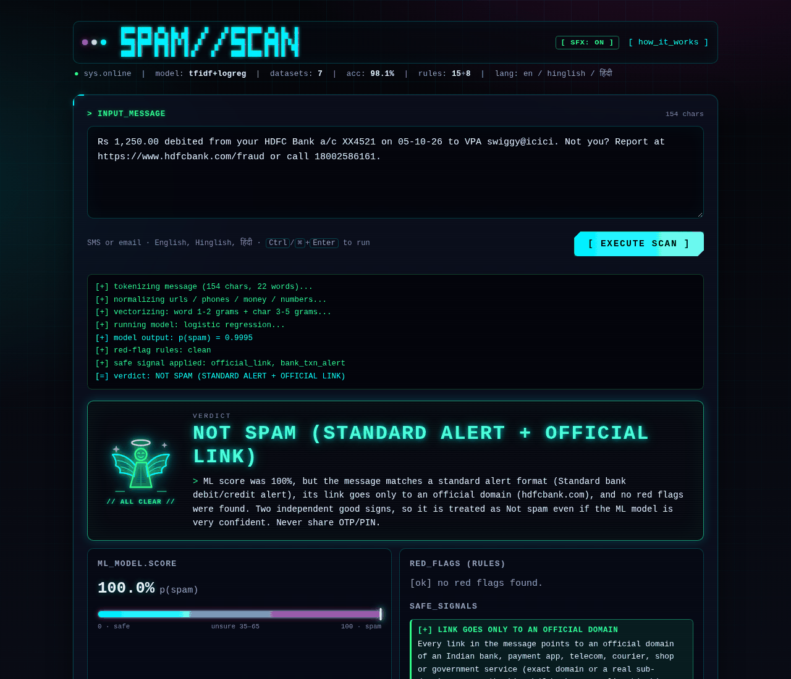
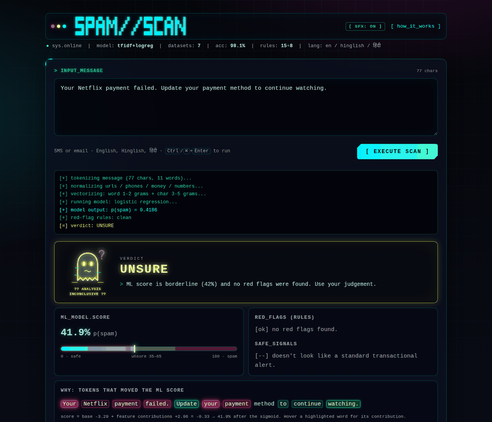
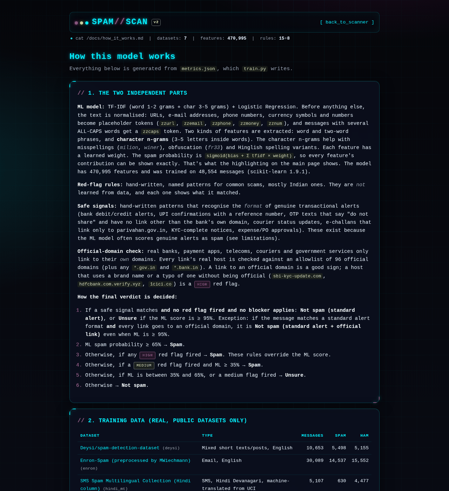
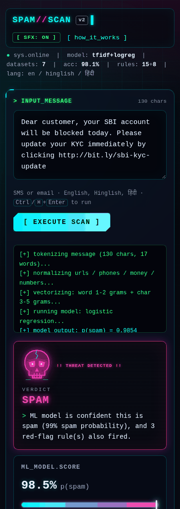
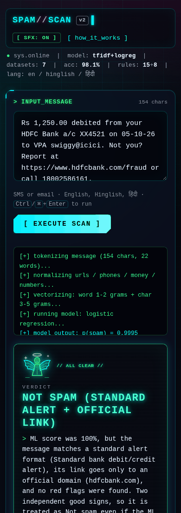
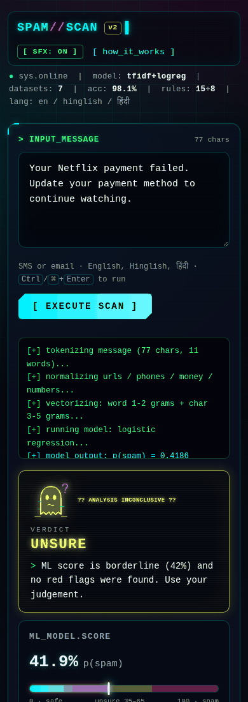
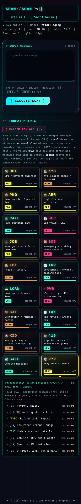
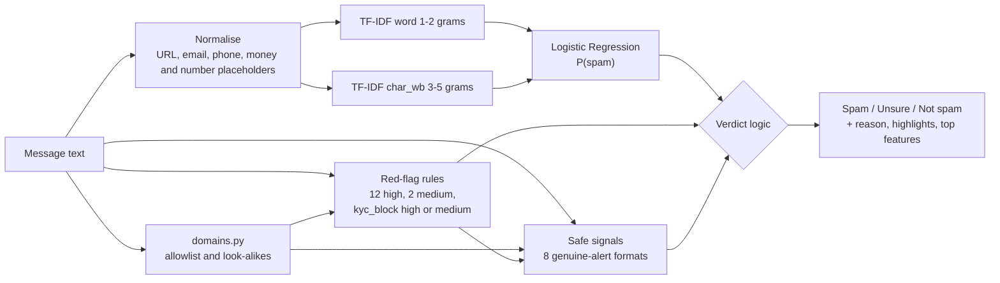

<div align="center">

# SPAM//SCAN

**An explainable spam and scam checker for Indian SMS and e-mail (English, Hinglish and Hindi).**

Paste a message. You get a verdict (Spam, Unsure or Not spam), the reason for it, the scam rules that fired, and the words that pushed the score up or down.

[](https://www.python.org/)
[](https://flask.palletsprojects.com/)
[](https://scikit-learn.org/)
[](LICENSE)

[Live demo](#live-demo) · [Quick start](#quick-start) · [How it works](#how-it-works) · [Results](#results) · [Limitations](#limitations) · [Documentation](#documentation)



</div>

> [!IMPORTANT]
> SPAM//SCAN is an educational project, not a security product. A "Not spam" verdict is not a guarantee.
> Never share an OTP, UPI PIN or card details, and never pay through a link in a message, whatever the verdict says.
> If you have been defrauded in India, call **1930** or report it at [cybercrime.gov.in](https://cybercrime.gov.in).

---

## Live demo

**Try it online:** https://spam-scan.onrender.com (Hugging Face Spaces, free tier: the first visit after a quiet spell can take about a minute to wake up). See [Deploying to Hugging Face Spaces](#deploying-to-hugging-face-spaces).

## Features

- **Three verdicts, not two.** The result is *Spam*, *Unsure* or *Not spam*, with a sentence that explains how it was decided. An ML score between 35% and 65% counts as uncertain.
- **Machine learning you can inspect.** TF-IDF word 1–2 grams plus character 3–5 grams feed a logistic regression with **470,995 features**. Every word is highlighted by how much it pushed the score, and the exact contribution of each top feature is listed.
- **15 named red-flag rules for Indian scams:** UPI PIN to *receive* money, KYC/SIM block threats, parcel fees, "digital arrest", fake customer care, CEO fraud/BEC, job registration fees, emergency money requests, electricity disconnection, kidnap/sextortion extortion, prize claims, OTP requests, look-alike domains, brand/link mismatches and suspicious links. Each rule shows the exact text it matched.
- **8 safe signals for genuine alerts.** These recognise the format of bank debit/credit alerts, UPI confirmations, OTP notices, courier updates, official e-challans, KYC-complete notices and expense approvals, plus links that go only to an official domain. They are switched off by any red flag, payment request, PIN/OTP request, short link or non-official link.
- **Official-domain check.** There is a hand-checked allowlist of **96 official domains** (banks, UPI apps, telecoms, couriers, shops and government), and any `*.gov.in`, `*.nic.in`, `*.bank.in` or `.sbi` address counts as official. Look-alikes such as `hdfcbnk.com`, `1cici.co`, `hdfcbank.com.evil.xyz` and `onlinesbi.sbi@evil.xyz` are caught.
- **Works with messy text.** It handles misspellings (`u won 1 milion dolars`), Hinglish (`account band ho jayega`) and Devanagari Hindi.
- **Cyberpunk "hacker" UI.** The interface has a boot sequence, Matrix rain, a live scan log and a **Threat Matrix** of 18 example categories (83 example messages). There is also a random-payload button (or press <kbd>R</kbd>), optional Web Audio sound effects, and a neon skull, angel or ghost for each verdict. It respects *reduced motion*.
- **Transparency page** at `/how-it-works`, generated from `metrics.json`. It lists the datasets, per-dataset test scores, probe results, the strongest features, every rule and the full domain allowlist.
- **JSON API** (`POST /api/predict`) that returns everything the UI shows.
- **Runs locally and offline.** No external CDNs, fonts or trackers are used, and the app doesn't store your messages.

## Screenshots

| Threat Matrix with the Gray zone drawer open | Not spam: genuine alert with an official link |
|---|---|
|  |  |
| **Unsure: borderline message (ghost)** | **How it works page** |
|  |  |

<details>
<summary>Mobile screenshots</summary>

| Spam | Not spam | Unsure | Gray zone |
|---|---|---|---|
|  |  |  |  |

</details>

## Quick start

You need **Python 3.12 or newer** (`requirements.txt` pins numpy 2.5 and scipy 1.18, which need 3.12+). It was tested with Python 3.13 and scikit-learn 1.9.1. The trained model (`model.joblib`, about 8 MB) is in the repository, so you **don't** need to train anything.

```bash
git clone https://github.com/Rishabh-bgp/spam-scan.git
cd spam-scan
```

| OS | One-step start |
|----|----------------|
| macOS / Linux | `./run.sh` |
| Windows | `run.bat` (double-click it, or run it in Command Prompt) |

Then open **http://127.0.0.1:5000**. The script creates `.venv`, installs `requirements.txt` and starts the server. It only trains a model if `model.joblib` is missing.

<details>
<summary>Manual setup</summary>

**macOS / Linux**

```bash
python3 -m venv .venv
source .venv/bin/activate
pip install -r requirements.txt
python app.py                       # http://127.0.0.1:5000
PORT=8000 python app.py             # another port
```

**Windows (PowerShell)**

```powershell
python -m venv .venv
.venv\Scripts\Activate.ps1          # or: .venv\Scripts\activate.bat in cmd
pip install -r requirements.txt
python app.py
$env:PORT=8000; python app.py       # another port
```

If PowerShell blocks the activate script, run `Set-ExecutionPolicy -Scope CurrentUser RemoteSigned` once, or skip activation and call `.venv\Scripts\python.exe app.py`.

</details>

Try it from the command line:

```bash
curl -s -X POST http://127.0.0.1:5000/api/predict \
     -H "Content-Type: application/json" \
     -d '{"text": "Your SBI account will be blocked today, update KYC"}'
# -> "verdict": "spam", ML 63.7% plus the medium kyc_block rule (see docs/API.md)
```

Problems? See [docs/TROUBLESHOOTING.md](docs/TROUBLESHOOTING.md). Port 5000 is taken by AirPlay Receiver on many Macs.

## Project structure

```text
spam-scan/
├── app.py               # Flask app: UI, /how-it-works, /api/predict, /api/health, /api/model-info
├── explain.py           # exact per-feature explanations + the final verdict logic (decide)
├── redflags.py          # 15 red-flag rules and 8 safe signals (hand-written, readable regexes)
├── domains.py           # official-domain allowlist (96), link parsing, look-alike detection
├── textnorm.py          # text normalisation shared by training and serving
├── train.py             # trains the model, evaluates per dataset + probes, writes model.joblib + metrics.json
├── prepare_data.py      # downloads the 7 public datasets and builds data/combined.csv.gz
├── probes.py            # 167 hand-written robustness probes + 43 domain-matcher cases
├── examples.json        # Threat Matrix gallery: 18 categories, 83 messages (fake numbers/links)
├── metrics.json         # metrics written by train.py (shown on /how-it-works)
├── model.joblib         # trained scikit-learn pipeline (scikit-learn 1.9.1)
├── templates/           # index.html, how.html, base_style.html, fx.html (no external assets)
├── docs/                # detailed documentation + screenshots
├── requirements.txt     # pinned runtime deps: scikit-learn 1.9.1, numpy, scipy, joblib, flask, gunicorn
├── Dockerfile           # production image: python:3.13-slim + gunicorn on port 7860 (Hugging Face Space)
├── .dockerignore
├── deploy/hf/           # Hugging Face Space README (YAML front matter) + deploy.sh / deploy.py
├── requirements-data.txt  # + pandas, pyarrow (only to rebuild the dataset)
├── run.sh / run.bat     # one-step setup and start
└── data/                # (git-ignored) combined.csv.gz and raw downloads, created by prepare_data.py
```

## Deploying to Hugging Face Spaces

The repo ships a `Dockerfile` (gunicorn, port 7860, non-root user) and a one-command deploy script for a free [Hugging Face Docker Space](https://huggingface.co/docs/hub/spaces-sdks-docker):

```bash
HF_TOKEN=hf_xxxxxxxx deploy/hf/deploy.sh      # creates/updates <your-hf-username>/spam-scan
```

It creates the Space if it's missing, uploads the app files with the Space-specific README from `deploy/hf/README.md`, and waits for the build. Live URL: https://spam-scan.onrender.com. Docker, local gunicorn and troubleshooting are covered in [docs/DEPLOY.md](docs/DEPLOY.md).

## How it works

There are two independent parts. A **machine-learning model** gives a spam probability, and **hand-written rules** look for known scam patterns and genuine-alert formats. A small, fixed decision procedure combines them, so the reason for a verdict can always be stated in one sentence.



**Verdict logic** (`explain.decide`, thresholds `UNSURE_LOW = 0.35`, `UNSURE_HIGH = 0.65`):

1. **No red flag fired and a safe signal applies:**
   - alert format **plus** an official link gives **Not spam**, even if the ML score is very high;
   - otherwise, an ML score **≥ 95%** gives **Unsure**, and anything lower gives **Not spam**.
2. ML **≥ 65%** → **Spam**.
3. Any **high** red flag → **Spam**. Rules override the ML score.
4. A **medium** red flag and ML **≥ 35%** → **Spam**.
5. ML between **35% and 65%** → **Unsure**.
6. A **medium** red flag with ML < 35% → **Unsure**.
7. Otherwise → **Not spam**.

The full decision diagram is in [docs/ARCHITECTURE.md](docs/ARCHITECTURE.md). The rules are explained one by one in [docs/RULES.md](docs/RULES.md).

## Results

All numbers come from `metrics.json`, written by `train.py`. Each of the 7 datasets is split 80/20 (stratified, seed 42). The model is trained on the 80% (48,554 messages) and tested on the held-out 20% (12,142 messages) at a 50% threshold. I re-ran the held-out evaluation on the shipped `model.joblib`, and it reproduces these figures exactly.

| Test set | n | Accuracy | Precision | Recall | F1 |
|---|---:|---:|---:|---:|---:|
| **All** | 12,142 | **0.981** | 0.985 | 0.967 | **0.976** |
| SMS (UCI + Indian + Hindi) | 2,836 | 0.974 | 0.943 | 0.929 | 0.936 |
| E-mail (Enron + SpamAssassin) | 7,175 | 0.979 | 0.989 | 0.964 | 0.976 |
| `india_sms` | 401 | 0.985 | 0.967 | 0.993 | 0.980 |
| `india_2011` (English + Hinglish) | 387 | 0.969 | 0.995 | 0.943 | 0.968 |
| `hindi_mt` (machine-translated Hindi) | 1,022 | 0.966 | 0.882 | 0.833 | 0.857 |

**Hand-written robustness probes** (`probes.py`, never used for training): 167 messages in 13 groups.

| | ML model alone (P ≥ 0.5) | ML + rules (final verdict) |
|---|---:|---:|
| Original 12 groups (138 probes) | 108 / 138 | **131 / 138** (5 of the 7 misses are *Unsure*) |
| Official-domain group (29 probes) | 19 / 29 | **28 / 29** (the miss is *Unsure*) |
| **All 167 probes** | 127 / 167 (76%) | **159 / 167 (95%)** (6 of the 8 misses are *Unsure*) |
| Domain-matcher unit cases | | **43 / 43** |

> [!NOTE]
> The rules were written while looking at these probes, so the "ML + rules" column is **optimistic**. The "ML alone" column is the fairer test of the model.
> Per-group scores and the full list of misses are in [docs/TESTING.md](docs/TESTING.md).

## Limitations

These are known weaknesses. Please read them before trusting a verdict.

- **Genuine alerts without a link often come back *Unsure*.** There's very little public data of genuine Indian transactional SMS, so the ML model scores many real bank and UPI alerts at 95% or more. The safe signals can then only lower them to Unsure, not Not spam. Example: the HDFC debit alert without a link scores 100% and comes back Unsure.
- **Some formats aren't covered and become false positives.** "Please complete your periodic KYC update by visiting your nearest branch" scores 99.5% with the ML model and is marked **Spam**.
- **Typo-heavy promotional spam gets missed.** `Hot singels in ur area want to met u tonite, reply YES` is marked *Not spam* (22%). `Claime ur reward now!! limted time ofer` only reaches *Unsure*.
- **The ML model alone is much weaker than the full system** on modern Indian scams. It catches 0 of 4 emergency-money gallery examples and 1 of 4 CEO-fraud examples on its own, and the rules do the work there.
- **The probe scores are optimistic**, because the rules and the probes were written together.
- **The domain allowlist is hand-made.** A genuine domain that's missing from it but contains a brand name (a bank's sister company, a new campaign site) is flagged as a look-alike.
- **Non-Latin look-alike letters aren't caught.** This covers punycode/IDN homoglyphs such as a Cyrillic "а" in `pаypal.com`. Brand names in the link *path* (`evil.xyz/hdfcbank.com`) and bare IP-address links aren't caught by the look-alike rule either.
- **Old and thin data.** The e-mail corpora are from about 2000–2005. There are only a few hundred real Hinglish messages, and the Devanagari Hindi data is machine-translated, which shows in its lower F1 (0.857).
- **Bag of n-grams.** The model doesn't understand intent. "I won the match" and "you won a prize" share words.

## Roadmap

These are ideas, not promises. Contributions are welcome.

- [ ] Collect consented, anonymised **genuine Indian transactional SMS** to cut false positives at the source.
- [ ] Detect **IDN/punycode homoglyphs** and IP-address links in `domains.py`.
- [ ] Calibrate probabilities (for example with `CalibratedClassifierCV`) and re-tune the Unsure band.
- [ ] Move the probes into a `pytest` suite with CI on GitHub Actions.
- [ ] Add a separate, *untouched* test set for the rules so their real-world precision can be measured.
- [x] Ship a Dockerfile and a production WSGI setup (gunicorn), deployable to Hugging Face Spaces.
- [ ] Add more languages and scripts (Bengali, Tamil, Marathi...) and more real Hinglish data.

## Documentation

| Page | What's inside |
|---|---|
| [ARCHITECTURE.md](docs/ARCHITECTURE.md) | Components, request flow, the exact verdict logic, how explanations and highlights are computed |
| [MODEL.md](docs/MODEL.md) | Datasets, normalisation, features, classifier, training, evaluation and how to retrain |
| [RULES.md](docs/RULES.md) | Every red-flag rule and safe signal, the domain allowlist and look-alike matching, and how to add your own |
| [API.md](docs/API.md) | Every route, with request/response schemas and real captured responses |
| [TESTING.md](docs/TESTING.md) | Probe groups, current scores, misses and how to add probes |
| [UI.md](docs/UI.md) | Threat Matrix, Random Payload, SFX, the skull/angel/ghost, the Gray zone, deep links and accessibility |
| [DEPLOY.md](docs/DEPLOY.md) | gunicorn, Docker and the Hugging Face Spaces deploy script |
| [FAQ.md](docs/FAQ.md) | Common questions |
| [TROUBLESHOOTING.md](docs/TROUBLESHOOTING.md) | Port in use, scikit-learn version mismatch, Mac background process, and more |
| [CONTRIBUTING.md](CONTRIBUTING.md) · [CHANGELOG.md](CHANGELOG.md) · [SECURITY.md](SECURITY.md) | How to help, version history, responsible use |

## Contributing

Bug reports, **false positives and false negatives** (with personal details removed), new rules, new official domains and new probes are all welcome. See [CONTRIBUTING.md](CONTRIBUTING.md) and the issue templates.

## License

The code is released under the [MIT License](LICENSE) © 2026 Er. Rishabh Aryan.

The training datasets are **not** part of this repository and keep their own licences (see below). `model.joblib` is a model trained on them. If you plan to redistribute it or use it commercially, check the dataset licences first, because two of them are GPL.

## Author

**Er. Rishabh Aryan**, M.Tech student in Artificial Intelligence and Data Science, IIIT Bhagalpur.
GitHub: [@Rishabh-bgp](https://github.com/Rishabh-bgp)

## Acknowledgements

The model is trained only on real, public datasets. Thanks to their authors:

| Key | Dataset | Messages after de-dup (spam / ham) | Licence |
|---|---|---|---|
| `sms` | [UCI SMS Spam Collection](https://archive.ics.uci.edu/dataset/228/sms+spam+collection), Almeida & Gómez Hidalgo (2011) | 5,129 (629 / 4,500) | CC BY 4.0 |
| `enron` | [Enron-Spam, preprocessed CSV by M. Wiechmann](https://github.com/MWiechmann/enron_spam_data), from the corpus by Metsis, Androutsopoulos & Paliouras (2006) | 30,089 (14,537 / 15,552) | GPL-3.0 (CSV repository). Original corpus: see source |
| `spamassassin` | [Apache SpamAssassin public corpus](https://spamassassin.apache.org/old/publiccorpus/) | 5,785 (1,677 / 4,108) | No explicit licence. Its readme says copyright stays with the original senders; see source |
| `deysi` | [Deysi/spam-detection-dataset](https://huggingface.co/datasets/Deysi/spam-detection-dataset) (Hugging Face) | 10,653 (5,498 / 5,155) | Apache-2.0 |
| `india_sms` | [Indian Telecom SMS Spam Collection](https://github.com/junioralive/india-spam-sms-classification) by junioralive | 2,001 (728 / 1,273) | MIT |
| `india_2011` | IIIT-Delhi crowdsourced Indian SMS (Yadav, Kumaraguru, Goyal, Gupta & Naik, 2011), via a [GitHub mirror](https://github.com/princebari/-SMS-Spam-Classification-on-Indian-Dataset-A-Crowdsourced-Collection-of-Hindi-and-English-Messages) | 1,932 (965 / 967) | Not stated in the mirror; see source |
| `hindi_mt` | [SMS Spam Multilingual Collection](https://huggingface.co/datasets/dbarbedillo/SMS_Spam_Multilingual_Collection_Dataset) (Hindi column, UCI SMS machine-translated) | 5,107 (630 / 4,477) | GPL (as tagged on Hugging Face) |

Licences were checked on the source pages in October 2026. Please confirm them at the source before reusing any dataset.

Also built with [scikit-learn](https://scikit-learn.org/), [Flask](https://flask.palletsprojects.com/), [NumPy](https://numpy.org/) and [joblib](https://joblib.readthedocs.io/). The skull, angel and ghost are original inline SVGs.
