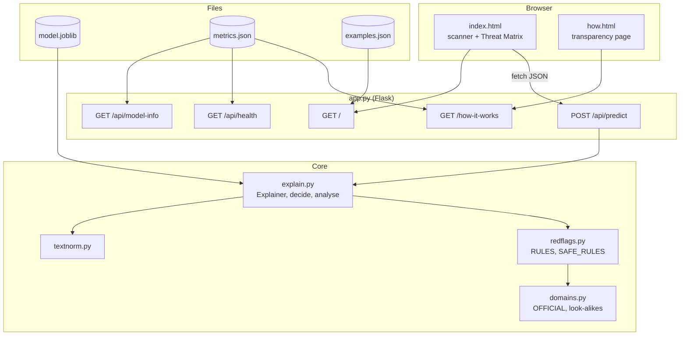
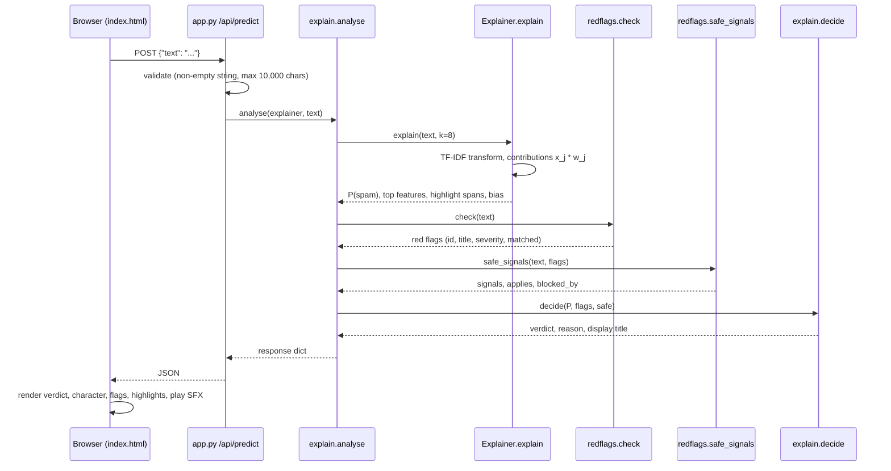
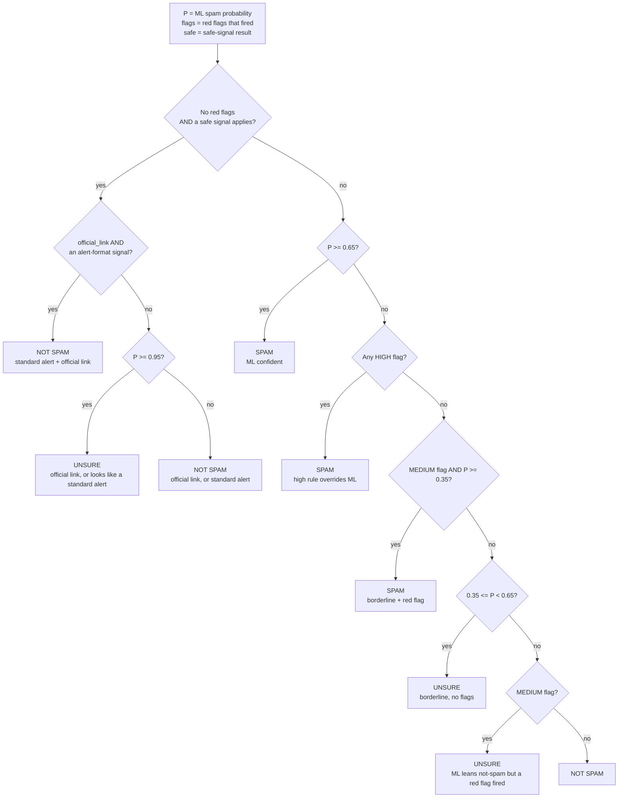

# Architecture

This page describes how SPAM//SCAN is put together: the components, what happens on each request, the exact rules for the final verdict, and how the explanations are computed.

← Back to the [README](../README.md) · See also [MODEL.md](MODEL.md), [RULES.md](RULES.md), [API.md](API.md)

## Contents

- [Components](#components)
- [Start-up](#start-up)
- [Request flow](#request-flow)
- [Verdict decision logic](#verdict-decision-logic)
- [Explanations and highlighting](#explanations-and-highlighting)
- [Threat Matrix statistics](#threat-matrix-statistics)
- [Design choices](#design-choices)

## Components

| Module | Role | Learned from data? |
|---|---|---|
| `textnorm.py` | `normalize()` / `normalize_short()`: placeholder tokens for URLs, e-mails, money, phones and numbers; undoes Enron's pre-tokenisation; adds `zzcaps` | No |
| `train.py` | Builds the scikit-learn `Pipeline` (TF-IDF word + char → `LogisticRegression`), evaluates it, and writes `model.joblib` and `metrics.json` | Trains the model |
| `model.joblib` | The fitted pipeline. It references `textnorm.normalize` / `normalize_short` by import path, so `textnorm.py` must be importable when the model is loaded | Yes |
| `explain.py` | `Explainer` (exact per-feature contributions and highlight spans), `decide()` (the verdict logic), `final_verdict()`, and `analyse()` (the API response) | No |
| `redflags.py` | `RULES` (15 red-flag rules) with `check()`, and `SAFE_RULES` (8 safe signals) with `safe_signals()` | No |
| `domains.py` | Link extraction, the `OFFICIAL` allowlist (96 entries), shortener and neutral lists, and brand look-alike detection | No |
| `app.py` | Flask app: loads everything once, computes gallery statistics, and serves the pages and JSON API | No |
| `templates/` | Jinja2 templates: `index.html` (scanner + Threat Matrix), `how.html` (transparency page), `base_style.html` (shared CSS), `fx.html` (Matrix rain + boot sequence) | No |
| `examples.json` | The Threat Matrix gallery: 18 categories, 83 messages, each with an `expected` label | No |
| `probes.py` | Hand-written robustness probes and domain-matcher unit cases | No |



## Start-up

When `python app.py` runs (or the module is imported), `app.py` does this:

1. If `model.joblib` is missing, it exits with the message "model.joblib not found. Run `python train.py` first."
2. It loads `model.joblib` with joblib and wraps it in `Explainer`. This caches the coefficient vector, the intercept and the 470,995 feature names.
3. It reads `metrics.json` (optional) and `examples.json` (optional).
4. **`compute_example_stats()`** runs every gallery example through the model and the rules once, and caches the results. Each example gets `verdict`, `ml_probability` and a short `lang_code` (EN / HI-EN / HI / TYPO), and each category gets `stats` (see [Threat Matrix statistics](#threat-matrix-statistics)).
5. It creates the Flask app. A context processor injects `fx` (feature count, rule counts, number of datasets, accuracy) into every template for the status line and boot screen.
6. It serves on `HOST` (default `127.0.0.1`) and `PORT` (default `5000`) with Flask's built-in development server and `debug=False`.

## Request flow

What happens when you press **[ EXECUTE SCAN ]** (or call the API):



1. **Validation** (`app.api_predict`). The body must be JSON with a non-empty string `text`, or the response is HTTP 400. Text longer than `MAX_CHARS = 10000` gives HTTP 413, and so does a request body over 256 KB (`MAX_CONTENT_LENGTH`), which Flask rejects before the view runs.
2. **ML score** (`Explainer.explain`). The pipeline's `features` step turns the text into a sparse TF-IDF vector. The probability is computed directly as `sigmoid(intercept + Σ x_j·w_j)`, which is the same value as `predict_proba` for binary logistic regression.
3. **Red flags** (`redflags.check`). All 15 rules run on the original text, not the normalised one.
4. **Safe signals** (`redflags.safe_signals`). All 8 signals run, and then the blockers are checked.
5. **Decision** (`explain.decide`). The steps are listed below.
6. **Response** (`explain.analyse`). The response keeps the fields from the first version (`label`, `spam_probability`, `confidence`) and adds the verdict, the rules and the explanations. See [API.md](API.md).

The browser shows a scan log while the request is in flight. The log lines are cosmetic, except for the real model output, flags and verdict at the end. It then renders the result and plays the matching sound if SFX is on.

## Verdict decision logic

Constants in `explain.py`: `UNSURE_LOW = 0.35` and `UNSURE_HIGH = 0.65`. The 95% cut-off for safe signals is written inline as `prob >= 0.95`. Severity is `high` or `medium`. `kyc_block` decides its own severity for each message (see [RULES.md](RULES.md#kyc_block)).



The same logic as a table:

| # | Condition (checked in order) | Verdict | `verdict_display` |
|---|---|---|---|
| 0a | no flags, safe applies, `official_link` **and** an alert format | ham | `Not spam (standard alert + official link)` |
| 0b | no flags, safe applies, only `official_link`, P ≥ 0.95 | unsure | `Unsure (official link)` |
| 0c | no flags, safe applies, only `official_link`, P < 0.95 | ham | `Not spam (official link)` |
| 0d | no flags, safe applies, alert format only, P ≥ 0.95 | unsure | `Unsure (looks like a standard alert)` |
| 0e | no flags, safe applies, alert format only, P < 0.95 | ham | `Not spam (standard alert)` |
| 1 | P ≥ 0.65 | spam | `Spam` |
| 2 | any high flag | spam | `Spam` |
| 3 | a medium flag and P ≥ 0.35 | spam | `Spam` |
| 4 | 0.35 ≤ P < 0.65 | unsure | `Unsure` |
| 5 | a medium flag (P < 0.35) | unsure | `Unsure` |
| 6 | otherwise | ham | `Not spam` |

Notes:

- **A safe signal never overrides a red flag.** `safe_signals()` lists every red flag as a blocker, and `decide()` checks `not flags` again.
- **An official link alone is not enough when the ML model is very sure.** "Big Billion Days are LIVE! ... https://www.flipkart.com" scores 99% and ends up *Unsure (official link)*.
- When a safe signal matched but was **blocked**, the reason in rules 1 and 4 says why, for example: "A standard-alert format was detected but not applied (urges you to call a number to avoid blocking ...)".
- The `label` field (kept from the first version of the API) is `spam` if the verdict is spam, **or** if the verdict is unsure and P ≥ 0.5. Otherwise it is `ham`.

### Worked examples (captured from the running app)

| Message | P(spam) | Flags / signals | Verdict |
|---|---:|---|---|
| `You have wo 1 million dollars` | 0.919 | `prize_claim` (high) | Spam (rule 1) |
| `Your SBI account will be blocked today, update KYC` | 0.637 | `kyc_block` (medium) | Spam (rule 3) |
| `HDFC Bank: your netbanking will be deactivated. Login to continue: hdfcbnk.com/login` | 0.495 | `lookalike_domain` (high) | Spam (rule 2) |
| `Your Netflix payment failed. Update your payment method to continue watching.` | 0.419 | none | Unsure (rule 4) |
| HDFC debit alert + `https://www.hdfcbank.com/fraud` | 0.9995 | `official_link` + `bank_txn_alert` | Not spam (0a) |
| `Rs 450.00 sent to Ramesh Kumar via UPI ... UPI Ref 427815536201 ...` | 0.984 | `upi_confirmation` | Unsure (0d) |
| `Your SBI a/c XX4521 is debited Rs 9,999. If not done by you, call 9876543210 immediately to block your account.` | 0.998 | `bank_txn_alert` **blocked** ("urges you to call a number to avoid blocking") | Spam (rule 1) |

## Explanations and highlighting

The model is linear in its features, so its explanations are exact. There is no SHAP or LIME approximation:

```
logit = intercept + Σ_j x_j · w_j        P(spam) = 1 / (1 + e^(−logit))
```

`x_j` is the TF-IDF value of feature *j* in this message, and `w_j` is its learned weight. The intercept (`bias` in the API) is **−3.288** for the shipped model.

**Top features.** `Explainer.explain(text, k=8)` returns up to 8 features with the largest positive contributions (`top_spam_features`) and up to 8 with the most negative ones (`top_safe_features`). Each feature has:

- `feature`: the word, two-word phrase, or character n-gram. In char n-grams, spaces are shown as `␣`, so `␣wo␣` is the whole word "wo".
- `type`: `word`, `phrase` (a word bigram) or `char`.
- `contribution`: `x_j · w_j`, rounded to 4 decimal places.
- `words`: up to 3 normalised words that the feature came from.

**Mapping features back to words** (`Explainer._word_hits`):

- A word feature hits each normalised word equal to it. A bigram hits the pair of adjacent words.
- For char n-grams (`char_wb` pads words with spaces): `␣abc␣` hits a word equal to `abc`, `␣abc` hits words that start with `abc`, `abc␣` hits words that end with `abc`, and `abc` hits words that contain it.
- A feature's contribution is **split equally** among the words it hits.

**Highlight spans** (`Explainer._spans`):

1. Each whitespace-separated token of the *original* text is normalised (so `1` becomes `zznum`, `http://...` becomes `zzurl`, and so on).
2. Its score is the sum of the per-word scores of its normalised pieces. If the same normalised word appears more than once, its scores are averaged.
3. Tokens with `|score| ≥ 0.02` are returned as `{start, end, text, score}`, with character offsets into the original text.

The UI colours positive scores pink (towards spam) and negative scores green (towards not spam). The intensity is relative to the largest absolute score in the message, with a minimum scale of 0.5. Hovering a highlighted word shows its contribution. Under the highlights the UI prints the arithmetic: `score = base −3.29 + feature contributions … = logit → P% after the sigmoid`.

> Because the scores are spread over words, the highlighted words do not add up exactly to the logit. Character n-grams that span normalised tokens, and words that occur more than once, are approximated. The **feature tables** are exact.

## Threat Matrix statistics

These are computed once at start-up by `app.compute_example_stats()`:

- **`ml_correct`**: examples where the ML model alone (P ≥ 0.5 means spam) agrees with `expected`.
- **`final_correct`**: examples where the final verdict equals `expected`. For the Gray zone, `expected` is `unsure`.
- **`level`**: computed by `threat_level(ml_correct, total)`. It is `LOW` if the ML model alone catches everything, `MED` if it catches at least 75%, `HIGH` if at least 50%, and `CRIT` otherwise. The `genuine` category is always `SAFE` and `gray` is always `GRAY`.

So the level shows **how often the ML model on its own misses that scam type**, and "caught x/y" shows how the whole system does. See [UI.md](UI.md#threat-matrix).

## Design choices

- **Logistic regression rather than a deep model.** It gives exact, cheap explanations, runs on a laptop in milliseconds, and scored about the same as a calibrated LinearSVC in the author's comparison (see the `train.py` docstring).
- **Rules kept separate from ML.** The rules are readable regular expressions that you can audit. Each one says what it matched, and the API returns rules and ML score separately, so you can always see which part decided.
- **Three-way verdict.** An honest "Unsure" is better than a confident wrong answer, especially for genuine alerts that the ML model mis-scores.
- **No external assets.** Templates inline all their CSS, JS and SVG. The sounds are synthesised with the Web Audio API.
