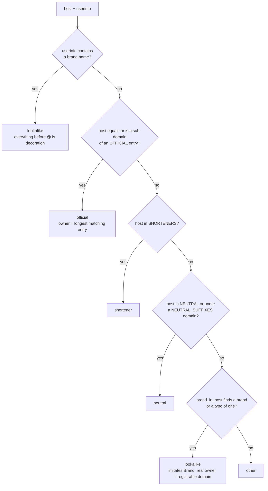

# Red-flag rules, safe signals and the official-domain check

The rules are the hand-written half of SPAM//SCAN. They live in [`redflags.py`](../redflags.py) and [`domains.py`](../domains.py). None of them are learned from data. Every rule has a name and a plain-language explanation, and it returns the exact text it matched, so you can always see why it fired.

← Back to the [README](../README.md) · See also [ARCHITECTURE.md](ARCHITECTURE.md#verdict-decision-logic) for how the rules feed into the verdict

## Contents

- [How rules work](#how-rules-work)
- [Red-flag rules (15)](#red-flag-rules)
- [Safe signals (8)](#safe-signals)
- [Official domains and look-alikes (`domains.py`)](#official-domains-and-look-alikes)
- [How to add an official domain](#how-to-add-an-official-domain)
- [How to add a red-flag rule](#how-to-add-a-red-flag-rule)
- [How to add a safe signal](#how-to-add-a-safe-signal)
- [Known gaps](#known-gaps)

## How rules work

- **Pattern groups.** Most red-flag rules are a list of regular expressions, and the rule fires only if **every** group matches somewhere in the message. For example, `parcel_fee` needs *parcel/courier* **and** *fee/held/seized* **and** *a link or call*. Requiring all groups keeps genuine look-alikes such as bank OTPs and courier tracking messages from firing.
- **Case-insensitive, run on the original text.** The rules run on the original text, not the normalised one, so `₹`, links and numbers are still visible.
- **Tolerant wording.** The patterns include common misspellings (`recieve`, `clik`, `blokd`, `suspnded`), Hinglish (`bhejo`, `band ho jayega`, `milega`) and some Devanagari (`लिंक`, `पुलिस`, `लॉटरी`).
- **Five rules use custom logic** instead of plain groups: `kyc_block`, `prize_claim`, `lookalike_domain`, `brand_link_mismatch` and `suspicious_link`.
- **Severity.** A **high** flag makes the verdict Spam whatever the ML score. A **medium** flag gives Spam if ML ≥ 35%, and Unsure otherwise.
- **Output.** Each flag is `{id, title, explanation, severity, matched}`. `matched` holds up to a few unique snippets, each cut to 60 characters.

You can test the rules without the model:

```bash
python redflags.py "Your SBI account will be blocked today, update KYC"
# [medium] KYC / account / SIM block threat: ['will be blocked', 'update KYC']
python domains.py hdfcbank.com.evil.xyz     # prints how each link is classified
```

## Red-flag rules

Shared building blocks used by several rules:

- **`CALL_OR_LINK`** matches a URL, a phone number, or the words *click/clik, link, call/cal, press N, dial*, or Hindi *लिंक, कॉल, क्लिक*.
- **`MONEY`** matches `rs 5`, `₹5`, `inr 5`, `$5`, `£5`, `5 rupees / dollars / lakh / crore / hazar / k`, or the words *lakh, crore, million, money, funds, amount, cash, paise*, or Hindi *रुपये, लाख, करोड़, पैसे*.
- **`PHONE`** matches an optional `+`, then 10 or more digits, spaces, `-` or masked `X`.

| # | id | Title | Severity |
|---|---|---|---|
| 1 | [`upi_pin_receive`](#upi_pin_receive) | UPI PIN to receive money | high |
| 2 | [`kyc_block`](#kyc_block) | KYC / account / SIM block threat | **high or medium** |
| 3 | [`parcel_fee`](#parcel_fee) | Parcel / courier fee or seizure | high |
| 4 | [`arrest_payment`](#arrest_payment) | Police / CBI / arrest threat with payment | high |
| 5 | [`fake_customer_care`](#fake_customer_care) | Unofficial customer-care number asking for OTP/app | high |
| 6 | [`urgent_wire_transfer`](#urgent_wire_transfer) | Urgent wire transfer / gift cards / changed bank details | high |
| 7 | [`job_fee`](#job_fee) | Job offer that asks you to pay | high |
| 8 | [`emergency_money`](#emergency_money) | Emergency money request | high |
| 9 | [`utility_disconnect`](#utility_disconnect) | Electricity / gas disconnection threat | high |
| 10 | [`extortion_threat`](#extortion_threat) | Kidnap / blackmail threat with a money demand | high |
| 11 | [`prize_claim`](#prize_claim) | Prize / lottery / "you won" claim | high |
| 12 | [`otp_request`](#otp_request) | Asks you to share an OTP/PIN | high |
| 13 | [`lookalike_domain`](#lookalike_domain) | Look-alike / fake brand web address | high |
| 14 | [`brand_link_mismatch`](#brand_link_mismatch) | Names a brand, but the link goes somewhere else | medium |
| 15 | [`suspicious_link`](#suspicious_link) | Shortened or look-alike link | medium |

All the example outputs below were produced by running `redflags.check()` on the message shown.

### `upi_pin_receive`

**High.** You never need to enter a UPI PIN to *receive* money. This is the classic collect-request scam.

- **Triggers when:** the message mentions a *UPI PIN* (`upi pin`, `pin … upi`, `यूपीआई पिन`) **and** a receiving or reward word (*receive/recieve, get, got, credit, cashback, reward, refund, collect, milega, mila, advance, prize, free, पाने*…).
- **Example:** `Congratulations! You have received Rs 5000 cashback on Paytm. Enter your UPI PIN to receive the amount in your account.` → matched `UPI PIN`, `receiv`
- **Hinglish:** `Aapko Rs 2000 cashback mila hai! Paise receive karne ke liye UPI PIN daalein` → matched `UPI PIN`, `cashback`

### `kyc_block`

**High or medium**, depending on the message. It threatens to block or suspend your bank account, wallet or SIM, and demands a KYC, PAN or Aadhaar update. It has two forms:

**Form A (original):** the message has
1. a KYC entity: *KYC, PAN, Aadhaar, SIM, YONO, केवाईसी, खाता, सिम*,
2. a block-ish word: *block/blok, suspend, deactivate, expire/expird, band, बंद, disconnect, frozen/freeze, lock, pending, incomplete*,
3. `CALL_OR_LINK`.

In that case it is **high**. If every link goes to an **official** domain and there is no phone number, it is **medium** instead, with the note "link is to an official domain, so medium not high".

**Form B (widened, no link needed):** the message has
- a **threat**: `will/shall/may/to be blocked/suspended/deactivated/disabled/frozen/closed…`, Hinglish `block/band/suspend ho jayega / kar diya jayega`, `account/SIM/wallet/card is (now) blocked/suspended/on hold`, `blocked today/tonight/within…`, `KYC (has been) expired`, or Hindi `बंद कर दिया जाएगा / ब्लॉक हो जाएगा`, **and**
- a **demand**: `re-KYC`, `update/complete/verify/link/submit/renew … KYC/PAN/Aadhaar`, `KYC … update/karein/karo/करें/अपडेट`, or `केवाईसी अपडेट`.

Then:
- with a link or phone number it is **high**. It is **medium** if the only link is official and there's no phone number;
- with no link or number it is **medium**, unless the message mentions a *branch*, *visit* or `शाखा`. Genuine banks send you to a branch, so the rule then **doesn't fire**.

It **does not fire** on "your KYC is verified/complete" notices.

| Message | Result |
|---|---|
| `Dear SBI customer, your YONO account will be blocked today. Update your PAN/KYC immediately: http://sbi-yono-kyc.co/update` | **high**: `YONO`, `block`, `http://sbi-yono-kyc.co/update` (and `lookalike_domain` + `suspicious_link` also fire) |
| `Your SBI account will be blocked today, update KYC` | **medium**: `will be blocked`, `update KYC` → Spam at ML 63.7% |
| `Aapka account block ho jayega, KYC update karein` | **medium**: `block ho jayega`, `KYC update` |
| `Dear Customer, your account will be blocked today. Please update your KYC by visiting your nearest branch.` | no flag (branch/visit switches off form B without a link) |
| `Your KYC has been successfully verified. Your Zerodha account is now active.` | no flag |

> Because form A includes *expire* and *pending*, a message such as "KYC expired … call 98XXXXXX12" is **high** even without a block threat. This is deliberate: real banks don't ask you to fix KYC through a number or link in an SMS.

### `parcel_fee`

**High.** It says a parcel is held, undeliverable or seized, and asks for a small fee, customs duty or a call.

- **Triggers when:** there is a parcel word (*parcel, package/packge, shipment, courier, deliver, consignment, पार्सल*) **and** a fee or problem word (*fee, charge, duty, pay, bharne, clearance, seized, held, illegal, custom*) **and** `CALL_OR_LINK`.
- **Example:** `India Post: Your parcel is held at our warehouse due to incomplete address. Pay Rs 25 redelivery fee within 48 hours: indiapost-redeliver.top` → matched `parcel`, `held`, `indiapost-redeliver.top` (plus `lookalike_domain` "imitates India Post" and `suspicious_link`)

### `arrest_payment`

**High.** It impersonates the police, CBI, customs, TRAI or a court and threatens arrest unless you pay or cooperate (the "digital arrest" scam).

- **Triggers when:** there is an authority word (*arrest/arest, CBI, police, cyber cell, customs, FIR, warrant, narcotic, drugs, money laundering, TRAI, jail, court, गिरफ्तार, पुलिस*) **and** a payment or cooperation word (*transfer, pay, fine, deposit, bhej, send, google pay/gpay, press N, talk to the officer, video call, disconnect*, or `MONEY`).
- **Example:** `This is CBI officer Rajesh Mishra. An FIR has been registered against your Aadhaar for money laundering. Transfer Rs 2,50,000 to avoid arrest.` → matched `CBI`, `money`

### `fake_customer_care`

**High.** It gives a "customer care" or helpline number and asks for an OTP or card details, or for you to install a remote-access app.

- **Triggers when:** there is a support word (*customer care/support, helpline, support team, executive, care number*) **and** a phone number **and** a risky request (*OTP, AnyDesk, TeamViewer, QuickSupport, install, download, card details, refund/refnd, suspend*).
- **Example:** `Facing issues with your refund? Call Amazon customer care 24x7 helpline 8293746510 and share the OTP to get your refund instantly.` → matched `customer care`, `8293746510`, `refund` (plus `otp_request`)

### `urgent_wire_transfer`

**High.** This is CEO fraud or business e-mail compromise (BEC): an urgent or confidential payment, gift-card codes, or payment to "new" bank details.

- **Triggers when:** there is a payment word (*wire transfer, bank transfer, remit, gift card(s), new vendor, new (bank) account, bank details, account has changed, change of bank*) **and** a pressure word (*urgent, asap, immediately, today, confidential, keep this, can't talk, board meeting, CEO, MD, director, frozen, reimburse*).
- **Example:** `I need you to process a wire transfer of $48,500 to a new vendor today. I'm in a board meeting and can't talk. Keep this confidential.` → matched `wire transfer`, `today`

### `job_fee`

**High.** A job, work-from-home or "selected candidate" message that asks for a registration fee, deposit or training charge.

- **Triggers when:** there is a job word (*job, hiring, selected, shortlisted, work from home, part time, salary/salry, offer letter, interview, ghar baithe, kamaye, earn, candidate, नौकरी*) **and** a payment word (*registration, fee, deposit, training kit, refundable, security, bhejein, pay, charge(s)*).
- **Example:** `Congratulations! You are selected for a work from home job. Pay a registration fee of Rs 1,500 to confirm your joining.` → matched `selected`, `Pay`. This message *also* fires `prize_claim` (`selected` + `Rs 1`), because "selected" counts as a "win" word there.

### `emergency_money`

**High.** An urgent request for money citing an accident, a hospital, the police or a "new number".

- **Triggers when:** there is an emergency word (*accident, hospital, emergency, trouble/trubble, police station, lost my phone, new number, jail, turant, urgent/urjent, दुर्घटना, अस्पताल*) **and** a transfer word (*send, bhejo/bhej/bhejein, transfer, google pay/gpay, paytm, upi id*, or `MONEY`).
- **Example:** `Mom its me, I lost my phone and this is my new number. I need Rs 15,000 urgently, please send to this UPI id now` → matched `lost my phone`, `Rs 1`

### `utility_disconnect`

**High.** It threatens to cut your electricity, gas or water tonight and asks you to call a number or click a link.

- **Triggers when:** there is a utility word (*electricity (incl. typos), bijli, power/powr, gas, water connection, बिजली*) **and** a cut-off word (*disconnect, kaat, cut, band, बंद, काट*) **and** `CALL_OR_LINK`.
- **Example:** `Your electricity connection will be disconnected tonight at 9.30 pm due to unpaid bill. Call our officer immediately on 9876543210.` → matched `electricity`, `disconnect`, `Call`

### `extortion_threat`

**High.** It threatens harm to a family member ("your son is with us") or to leak a private video or photos, and demands money.

- **Triggers when:** there is a threat (*kidnap…, son/daughter/beti/beta/child/wife/husband … is with us / hamare paas / in our custody, never see him/her, will be hurt, recorded/watching/hacked … webcam, morphed photo, video … recorded, photos … contacts/family/friends*) **and** money (*bitcoin, BTC*, or `MONEY`) **and** pressure (*or, warna, otherwise, hurt, police, secret, don't inform/tell/call, within N hours/minutes, N ghante, watching, leak, viral, price*).
- **Examples:**
  - `Your son is with us. Send Rs 5 lakh within 2 hours or you will never see him again. Don't inform police.` → matched `son is with us`, `Rs 5`, `within 2 hours` (plus `arrest_payment`, because of *police* + *send*)
  - `I recorded you through your webcam. Pay $900 in bitcoin or the video goes to all your contacts.` → matched `recorded you through your webcam`, `$9`, `or`

### `prize_claim`

**High.** It claims you won a lottery, a lucky draw, a prize or a large sum.

- **Triggers when:** the message contains a **strong** word (*lottery/lotery/lottry, lucky draw, jackpot, लॉटरी, लकी ड्रा*), **or** both a **win** word (*won, w0n, wo, win, winner/winer/wnr, jeet…, jeeta, jita, जीत…, selected/slected, badhai*) and a **prize** word (*million/milion, billion, lakh, crore, cash, prize/prise, inaam, reward, voucher, iphone, claim/clame, colect, dollars, pounds, $5, £5, ₹5, rs 5, लाख, करोड़, इनाम, पुरस्कार*).
- **Examples:** `You have wo 1 million dollars` → `wo`, `million` · `congrats you won a lottery` → `lottery` · `बधाई हो! आपने 10 लाख रुपये की लॉटरी जीती है।` → `लॉटरी`
- **Doesn't fire on:** `I won the match today, so happy!`

### `otp_request`

**High.** It asks you to tell or share a one-time password, PIN or CVV.

- **Triggers when:** the message has *share/tell/give/batao/bataye/send* followed within 25 characters by *OTP/PIN/CVV*, **not** preceded by *not / never / n't / mat*. Also *OTP/CVV … batao / share karo / bhejo*, and `ओटीपी बताएं` / `OTP बताएं`.
- **Examples:** `Please share the OTP sent to your phone to complete the verification.` → `share the OTP` · `OTP batao jaldi, refund aa jayega` → `OTP batao`
- **Doesn't fire on:** `Your OTP for login is 482913. Do not share it with anyone.` or `Never share your OTP with anyone.`

### `lookalike_domain`

**High.** A link uses the name of a bank, payment app, telecom, courier or government service (or a typo of it) but is **not** that organisation's official domain. See [look-alike detection](#look-alike-detection).

- **Triggers when:** any link is classified as `lookalike` by `domains.analyse_links()`.
- **Matched output:** the host (or the whole raw link, for the `@` trick), `imitates <Brand>`, and `real owner: <registrable domain>` when it differs from the host.
- **Examples:**
  - `HDFC Bank: your netbanking will be deactivated. Login to continue: hdfcbnk.com/login` → `hdfcbnk.com`, `imitates HDFC Bank`
  - `SBI: your YONO access is paused. Re-activate at http://onlinesbi.sbi@evil.xyz/yono` → `http://onlinesbi.sbi@evil.xyz/yono`, `imitates SBI`

### `brand_link_mismatch`

**Medium.** The message names a brand and asks you to act, but its link goes to an unrelated site or a URL shortener.

- **Triggers when:** a link is classified `shortener` or `other`, **and** within the window from 200 characters before the link to 60 characters after it there is **both** a brand named in the text (`domains.TEXT_BRANDS`, for example *SBI, HDFC, Paytm, Amazon, Airtel, India Post, income tax/ITR, Aadhaar, e-challan…*) **and** a call to action (*verify, update, claim, click, log in, sign in, pay, confirm, redeem, activate, reschedule, track, unlock, KYC, refund, reward, cashback, download, install, submit, visit, karein, karo…*).
- It is skipped if a `lookalike_domain` link is present, because the high rule already covers that.
- **Examples:**
  - `Your Flipkart order is on hold. Confirm your address at bit.ly/fk-addr-123` → `mentions Flipkart`, `link goes to bit.ly (URL shortener)`
  - `Dear Airtel customer, claim your free 5G upgrade at freeupgrade.online today.` → `mentions Airtel`, `link goes to freeupgrade.online`

### `suspicious_link`

**Medium.** A URL shortener, a domain that mixes in words like *kyc/verify/secure/update/login*, or a cheap throw-away TLD.

- **Triggers when:** after links to official domains are masked out (`domains.mask_official`), the text contains:
  - a shortener link (`bit.ly`, `tinyurl.com`, `goo.gl`, `t.co`, `cutt.ly`, `is.gd`, `rb.gy`, `ow.ly`, `shorturl.at`, `tiny.cc`, `1kx.in` followed by `/…`), **or**
  - a hyphenated domain containing *kyc, verify/verfy, secure, update/updat, login, reward, refund, billing, track, support, redeliver* or *fee*, **or**
  - any domain ending in `.xyz`, `.top`, `.club`, `.online`, `.site`, `.live` or `.shop`.
- **Examples:** `Sirf aaj ke liye 90% discount! bit.ly/sale99` → `bit.ly/sale99` · `Verify now at secure-login-update.com` → `secure-login-update.com`

## Safe signals

Safe signals recognise the **format** of genuine transactional messages. They exist because the ML model often scores real alerts as spam. Each one is `(id, title, explanation, pattern groups, extra condition)`, and every group must match.

| id | Title | Matches when | Extra condition |
|---|---|---|---|
| `official_link` | Link goes only to an official domain | the message has links, and **every** link is official | not applied if the message also gives an Indian **mobile** number (`[6-9]XXXXXXXXX`, optional `+91`) |
| `bank_txn_alert` | Standard bank debit/credit alert | a masked account/card number (`a/c XX1234`, `**1234`) **and** *debited, credited, spent, withdrawn, avl bal, available balance, txn of* | none |
| `upi_confirmation` | UPI payment confirmation with reference number | `UPI` **and** a reference (`ref/UTR/txn/transaction (no./id)` + 6 or more digits) **and** *sent, received, debited, credited, paid, successful* | none |
| `otp_notice` | One-time password notice that warns not to share it | *OTP / one-time password / verification code / login code* **and** a 4–8 digit code **and** *do not share, don't share, never share, not to share, never ask, mat bataye, share na kare* | **no links**, except to an official domain (as in `@onlinesbi.sbi #123456`) |
| `delivery_update` | Courier / order status update | a courier or shop (*Delhivery, Blue Dart, DTDC, Ekart, XpressBees, Shadowfax, Ecom Express, India Post, Amazon, Flipkart, Myntra, Meesho*, or *order, shipment, AWB, tracking, consignment*) **and** a status (*shipped, out for delivery, delivered, dispatched, in transit, will arrive, arriving, will be delivered*) | none |
| `echallan_official` | Traffic e-challan pointing to the official portal | `e-challan` **and** `parivahan.gov.in` | the payment-request blocker is **not** applied to this signal (e-challans legitimately ask you to pay) |
| `kyc_complete` | KYC completed / verified notice | `KYC` **and** *successfully / been / is verified / completed / approved* | blocked if it also says *pending, expir, block, suspend, incomplete, update now/your/immediately, re-kyc* or *click* |
| `expense_approval` | Routine expense / payroll / PO approval | *expense, reimburse, payslip, salary slip, purchase order, PO, claim #* **and** *approved, processed, will be paid, has been paid, credited* | blocked if it also says *gift card, new (bank) account, change of bank, wire transfer* or *confidential* |

### Blockers

A safe signal is **not applied** if any of these is true. The UI lists each reason under "Why the safe signal was not applied", and the API returns them in `safe_signal_blocked_by`.

1. Any red flag fired (`red flag fired: <title>`).
2. A link goes to a non-official domain.
3. A shortened link (`bit.ly`, `tinyurl.com`, …, `u1.mnge.co`) is present.
4. The message asks you to enter, share, send, provide, give, tell, type, confirm, update, submit or reply with a *UPI PIN, PIN, OTP, password, passcode, CVV, card number/details, net banking, login details* or *MPIN*. Negated forms ("do **not** share your PIN") don't count.
5. The message asks for a payment or fee (`pay now/rs/₹…`, `fee`, `charges of`, `deposit`, `transfer/send rs…`, `payment of/due`, or paying to a UPI ID). This blocker doesn't apply to `echallan_official`.
6. The message urges you to call, contact, dial or WhatsApp in order to avoid blocking, suspension or disconnection.
7. A signal's own extra condition fails (see the table). Such a signal is ignored, but another clean signal can still apply.

### Examples (captured)

| Message | Signals | Applied? |
|---|---|---|
| `Your OTP for login is 482913. Do not share it with anyone. It is valid for 10 minutes.` | `otp_notice` | yes |
| `Rs 450.00 sent to Ramesh Kumar via UPI on 06-Oct. UPI Ref 427815536201. Not you? Call 1800-111-109 - SBI` | `upi_confirmation` | yes (verdict still only *Unsure*, because ML is 98.4%) |
| `Your Delhivery shipment AWB 1234567890 is out for delivery today. Track: https://www.delhivery.com/track` | `official_link`, `delivery_update` | yes |
| `Your ITR for AY 2026-27 has been processed. Check the status at https://www.incometax.gov.in` | `official_link` | yes |
| `Your OTP is 552341. Do not share it with anyone. If you did not request this, click http://sbi-secure-cancel.co to cancel.` | `otp_notice` | **no**: look-alike link, non-official domain, "OTP messages should not contain links" |
| `Your KYC has been successfully verified! Click bit.ly/kyc-bonus to claim your Rs 500 reward.` | `kyc_complete` | **no**: shortened link, and "also contains 'Click'" |
| `Rs 4,999 credited to your a/c XX1234 as GST refund. To receive it, enter your UPI PIN at http://gst-refund-upi.in` | `bank_txn_alert` | **no**: `upi_pin_receive` fired, and it asks for a PIN |
| `Your Jio recharge is done. Details: https://www.jio.com/selfcare or call 9876543210` | `official_link` | **no**: "also gives a mobile number ('9876543210')" |

## Official domains and look-alikes

`domains.py` answers one question for every link in a message: **who really owns this address?**

### Link extraction

`domains.links(text)` finds:
- anything after `http://`, `https://` or `www.`,
- bare domains that end in a known TLD (`com net org info biz ly in co io xyz top club online site me us uk ru cn link live shop sbi app cc tk icu vip buzz store click support help …`),
- `bit.ly/…`, `amzn.to/…`, `fkrt.it/…`, `t.ly/…`, `is.gd/…`, `v.gd/…` and `rb.gy/…` short links.

For each link it keeps the **host**. Any scheme, `www.`, port, path, query and fragment are removed. Anything before an `@` (the "userinfo") is kept separately, because in `http://onlinesbi.sbi@evil.xyz/login` the real site is `evil.xyz`.

### Classification (`classify_host`, in this order)



- **Official** means an exact match or a **real sub-domain**: `host == d` or `host.endswith("." + d)`. So `netbanking.hdfcbank.com` is HDFC Bank, while `hdfcbank.com.evil.xyz` (owned by `evil.xyz`) and `hdfcbank-kyc.com` are not.
- **Restricted zones** are always official: `gov.in` (any `*.gov.in`), `nic.in`, `bank.in` (RBI's bank-only domain) and `sbi` (SBI's own top-level domain). Note that `gov.in.evil.com` is just `other`.
- **The allowlist has 96 entries** with owners. It covers the restricted zones; banks (SBI, HDFC, ICICI, Axis, Kotak, PNB, Bank of Baroda, Canara, Union, IDFC FIRST, Yes, IndusInd, BOI, Central Bank, Indian Bank, IOB, IDBI, Federal, RBL, AU, Bandhan, plus their cards, insurance and mutual-fund sites); RBI, NPCI and BHIM; Paytm, PhonePe, Google Pay (`pay.google.com`), MobiKwik, Razorpay, Zerodha, Groww and PayPal; Amazon (in/com/co.uk/de/ca/com.au), Flipkart, Myntra, Meesho, Swiggy, Zomato, IRCTC, LIC, Netflix and MyGov; Jio, Airtel, Vi and BSNL; India Post, Delhivery, Blue Dart, DTDC, Ekart, XpressBees, Shadowfax, Ecom Express, FedEx, DHL and UPS; and named government services (Income Tax, UIDAI, EPFO, Parivahan, Cybercrime portal, Sanchar Saathi). The full list is in `domains.OFFICIAL` and on `/how-it-works`.
- **Neutral** covers brand-owned short links (`amzn.to`, `amzn.in`, `a.co`, `fkrt.it`, `paytm.me`, `p-y.tm`) and hosting or unrelated companies whose names contain a brand word (`amazonaws.com`, `cloudfront.net`, `axis.com`). Anyone with an account can create these links, so they are neither a good sign nor a look-alike.
- **Shorteners** (21): `bit.ly`, `tinyurl.com`, `goo.gl`, `t.co`, `cutt.ly`, `is.gd`, `rb.gy`, `ow.ly`, `shorturl.at`, `tiny.cc`, `1kx.in`, `u1.mnge.co`, `t.ly`, `s.id`, `v.gd`, `shorte.st`, `rebrand.ly`, `bl.ink`, `tinu.be`, `short.gy`, `qr.ae`.

### Look-alike detection

`brand_in_host(host)` checks 36 brands (`domains.BRANDS`):

1. **Tokens.** The public suffix is dropped. `.com` and `.in` are one label; `co.in`, `gov.in`, `bank.in`, `co.uk` and other two-level suffixes are two. Each remaining label is used whole and also split on hyphens. For example, `sbi-kyc-update.com` gives the tokens `sbi-kyc-update`, `sbi`, `kyc`, `update`.
2. **Homoglyph variants.** Each token is also tried with digit and symbol swaps: `0→o 1→i 3→e 4→a 5→s 7→t 8→b @→a $→s`, then `1→l`, then `rn→m` and `vv→w`. So `1cici` becomes `icici`, `paypa1` becomes `paypal`, and `arnazon` becomes `amazon`.
3. **Brand regexes.** Short names are anchored to the start or end of a token, so `lesbian` and `turbine` don't match `sbi`. The anchored names are `^s+bi|sbi$` for SBI, `^pnb|pnb$`, `^rbi|rbi$`, `^jio|jio$` and `^dhl|dhl$`. Longer names match anywhere in the token, along with common typos (`hdffc`, `phonpe`, `flipcart`, `delhivry`, `fedx`, `netflx`, `aadhar/adhaar`…).
4. **One-typo fuzzy match** for long, distinctive names (`onlinesbi`, `statebank`, `hdfcbank`, `icicibank`, `axisbank`, `kotakbank`, `bankofbaroda`, `canarabank`, `unionbank`, `idfcfirst`, `indusind`, `flipkart`, `indiapost`, `bluedart`, `incometax`, `paypal`). This uses optimal-string-alignment distance ≤ 1, which covers an insert, a delete, a substitution or a swap of neighbours. So `hdcfbank` and `flipkrat` are caught.

The **registrable domain** (the real owner) is the last two labels of the host, or the last three for two-level suffixes. For example, `hdfcbank.co.in.verify.xyz` is owned by `verify.xyz`.

### Unit cases (a selection from `probes.DOMAIN_CASES`; all 43 pass)

| Link | Kind |
|---|---|
| `hdfcbank.com`, `https://netbanking.hdfcbank.com/x`, `onlinesbi.sbi`, `retail.onlinesbi.sbi`, `sbi.bank.in`, `canarabank.bank.in`, `myaadhaar.uidai.gov.in`, `pay.google.com`, `echallan.parivahan.gov.in` | official |
| `hdfcbank.com.evil.xyz`, `hdfcbank-kyc.com`, `sbi-kyc-update.com`, `hdfcbnk.com`, `hdcfbank.com`, `sbii.in`, `1cici.co`, `paypa1-support.net`, `arnazon.in`, `incometax-gov.in`, `sbi.bank.in.evil.com`, `flipkrat-sale.shop`, `http://onlinesbi.sbi@evil.xyz/login` | lookalike |
| `gov.in.evil.com`, `bank.in.evil.com`, `google.com`, `praxis.com`, `taxis.in`, `kodak.com`, `amazing.in`, `turbine.com`, `lesbian.com` | other |
| `bit.ly/abc` | shortener |
| `amzn.to/abc`, `paytm.me/x-1` | neutral |

### How official links affect other rules

- `suspicious_link` ignores links to official domains, because they are masked first.
- `kyc_block` drops from high to **medium** if every link is official and there is no phone number.
- `official_link` is a safe signal (see above). Together with an alert format it gives *Not spam* even if ML ≥ 95%. On its own it gives *Not spam* below 95% and *Unsure* at 95% or above.
- An official link **never** overrides a red flag. "Share the OTP … Details at https://www.hdfcbank.com" is still Spam.

## How to add an official domain

1. Make sure the domain is **genuinely** owned by the organisation. Use its own website, its app store listing, or a regulator's page, not search ads.
2. Add it to `OFFICIAL` in `domains.py` as `"example.co.in": "Owner name"`. Sub-domains are covered automatically.
3. If it's a **new brand**, also add:
   - an entry in `BRANDS` (`("Name", r"host-token regex", ["fuzzy-keyword"])`), so look-alikes of it are caught. Anchor short names (`^abc|abc$`);
   - an entry in `TEXT_BRANDS`, so `brand_link_mismatch` notices the brand when it is named in the message.
4. Add unit cases to `DOMAIN_CASES` in `probes.py`: the official domain, a sub-domain, one or two look-alikes, and an innocent word that contains the brand.
5. Run `python probes.py` and check that the domain matcher still passes every case and that no probe group got worse. Then restart the app.

## How to add a red-flag rule

1. Write down 3–5 real-looking scam messages, in English, Hinglish and with typos, **and** 2–3 genuine messages that look similar.
2. Add a tuple to `RULES` in `redflags.py`:

   ```python
   ("my_rule_id", "Short title",
    "Plain-language explanation shown to the user: what the scam is and why it's a red flag.",
    "high",                       # or "medium"
    [r"first group|alternative",  # ALL groups must match somewhere in the message
     r"second group",
     CALL_OR_LINK]),              # reuse CALL_OR_LINK / MONEY / PHONE / URL where useful
   ```

   For logic that groups can't express, set the groups to `None` and add an `elif rid == "my_rule_id":` branch in `check()`, as `kyc_block` and `prize_claim` do.
3. Prefer **several required groups** to one broad pattern. Use `\b` word boundaries for short words, and negative look-behinds for negations (see `otp_request`).
4. Add your messages to `probes.py`, either in an existing group or a new `INDIA_SCAMS["my_group"]`, and add a gallery example to `examples.json` if it helps users.
5. Run `python probes.py` and `python -c "import joblib, train; train.probe_report(joblib.load('model.joblib'))"` to compare ML-only and final scores. Check that no genuine probe turned into Spam.
6. Restart the app. The rule appears automatically on `/how-it-works`, in the API, and in the rule count in the status line.

## How to add a safe signal

Add a tuple to `SAFE_RULES`: `(id, title, explanation, [groups], extra)`. `extra` can be:

- `None` (no extra condition);
- `"no_link"` (blocked if there is any non-official link);
- a regex of words that genuine messages of this type **never** contain (the signal is blocked if it matches);
- `"official_link"` (reserved for the official-link signal).

Then add genuine probes **and** scam imitations of the same format to `INDIA_SCAMS["alert_lookalike_scams"]`, so you can show the new signal can't be abused.

## Known gaps

- **The allowlist is hand-made.** A missing genuine domain that contains a brand name (a sister company, a new campaign domain, a smaller bank's legacy domain) is flagged as a look-alike.
- **Non-Latin look-alike letters** (IDN/punycode, for example a Cyrillic "а") are **not** detected. Neither are brand names hidden in the *path* (`evil.xyz/hdfcbank.com`) or bare IP-address links.
- **Three TLD lists.** `textnorm.py`, `redflags.URL` and `domains.TLDS` each keep their own TLD list, so a link on an unusual TLD might be seen by one module and not another.
- **Rules can overlap or misfire.** For example, `prize_claim` also fires on "you are selected … Rs …" job messages. That's harmless there, because `job_fee` fires too, but it's worth knowing.
- **The rules were written alongside the probes**, so their measured accuracy is optimistic (see [TESTING.md](TESTING.md)).
